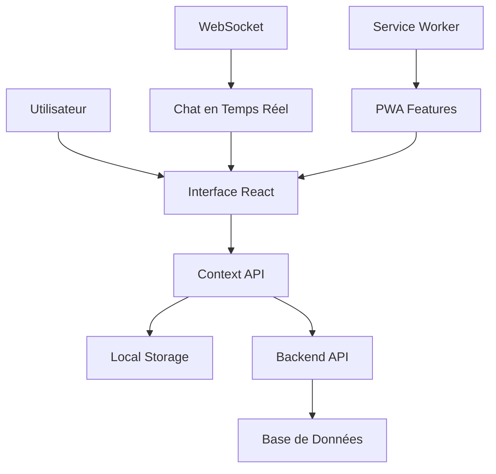

# 🏗️ Architecture du Projet EDIBA-INTER

## 📋 Vue d'ensemble

**EDIBA-INTER** est une application web moderne de gestion de facturation développée avec React, TypeScript et Vite. Elle intègre un système de chat en temps réel, une gestion complète des utilisateurs, et des modules de facturation avancés.

## 🎯 Technologies Principales

- **Frontend**: React 18 + TypeScript + Vite
- **Styling**: Tailwind CSS + CSS Modules
- **État**: React Context API + Hooks personnalisés
- **Routing**: React Router DOM
- **Build**: Vite + Rollup
- **Déploiement**: Netlify + Vercel
- **PWA**: Service Worker + Manifest

## 📁 Structure du Projet

```
project/
├── 📁 src/                          # Code source principal
│   ├── 📁 components/               # Composants React
│   │   ├── 📁 modules/             # Modules métier
│   │   ├── 📁 chat/                # Système de chat
│   │   └── 📄 *.tsx                # Composants UI
│   ├── 📁 contexts/                # Contextes React
│   ├── 📁 hooks/                   # Hooks personnalisés
│   ├── 📁 utils/                   # Utilitaires
│   ├── 📁 config/                  # Configuration
│   └── 📄 main.tsx                 # Point d'entrée
├── 📁 public/                      # Assets statiques
├── 📁 dist/                        # Build de production
├── 📄 vite.config.ts               # Configuration Vite
├── 📄 netlify.toml                 # Configuration Netlify
└── 📄 package.json                 # Dépendances
```

## 🔧 Modules Principaux

### 1. **Dashboard** (`Dashboard.tsx`)
- Interface principale de l'application
- Statistiques en temps réel
- Navigation entre modules
- Widgets d'activité récente

### 2. **Gestion des Utilisateurs** (`UsersModule.tsx`)
- CRUD complet des utilisateurs
- Gestion des rôles et permissions
- Profils utilisateurs avancés
- Système d'authentification

### 3. **Module de Facturation** (`InvoiceModule.tsx`)
- Création et gestion des factures
- Templates personnalisables
- Export PDF/Excel
- Suivi des paiements

### 4. **Module de Décharge** (`DischargeModule.tsx`)
- Gestion des décharges
- Workflow d'approbation
- Intégration avec la facturation

### 5. **Système de Chat** (`ChatModule.tsx`)
- Chat en temps réel
- Appels vocaux intégrés
- Partage de fichiers
- Notifications push

### 6. **Gestion des Fournisseurs** (`SuppliersModule.tsx`)
- Base de données fournisseurs
- Historique des commandes
- Intégration comptable

## 🎨 Design System

### **Couleurs Principales**
- **Primaire**: #25C1FF (Bleu EDIBA)
- **Secondaire**: #1E40AF (Bleu foncé)
- **Accent**: #10B981 (Vert succès)
- **Danger**: #EF4444 (Rouge erreur)

### **Composants UI**
- Design moderne et responsive
- Animations fluides
- Dark/Light mode support
- Accessibilité optimisée

## 🔄 Flux de Données



## 🚀 Déploiement

### **Netlify** (Production)
- Build automatique depuis GitHub
- CDN global
- HTTPS automatique
- Redirections SPA

### **Vercel** (Alternative)
- Déploiement instantané
- Preview deployments
- Analytics intégrées

## 📱 Fonctionnalités PWA

- **Installation**: Manifest.json configuré
- **Offline**: Service Worker actif
- **Notifications**: Push notifications
- **Sync**: Synchronisation en arrière-plan

## 🔒 Sécurité

- **Authentification**: JWT tokens
- **Autorisation**: Rôles et permissions
- **Validation**: TypeScript strict
- **Sanitisation**: Protection XSS

## 📊 Performance

- **Code Splitting**: Lazy loading des modules
- **Tree Shaking**: Élimination du code mort
- **Caching**: Stratégies de cache optimisées
- **Compression**: Gzip/Brotli

## 🧪 Tests

- **Unit Tests**: Vitest + React Testing Library
- **E2E Tests**: Cypress (prévu)
- **Type Checking**: TypeScript strict

## 📈 Monitoring

- **Logs**: Système de logging intégré
- **Métriques**: Performance monitoring
- **Erreurs**: Error boundary + reporting

## 🔧 Configuration

### **Variables d'Environnement**
```env
VITE_API_URL=https://api.ediba-inter.com
VITE_WS_URL=wss://ws.ediba-inter.com
VITE_APP_VERSION=1.0.0
```

### **Build Commands**
```bash
npm run dev          # Développement
npm run build        # Production
npm run preview      # Aperçu build
npm run test         # Tests
```

## 📚 Documentation

- **README.md**: Guide d'installation
- **CHANGELOG.md**: Historique des versions
- **docs/**: Documentation technique détaillée
- **Architecture**: Ce document

## 🎯 Prochaines Étapes

1. **Migration Supabase**: Base de données cloud
2. **Tests E2E**: Automatisation complète
3. **Mobile App**: React Native
4. **API GraphQL**: Optimisation des requêtes
5. **Microservices**: Architecture distribuée

---

**Version**: 1.0.0  
**Dernière mise à jour**: Décembre 2024  
**Maintenu par**: Équipe EDIBA-INTER
